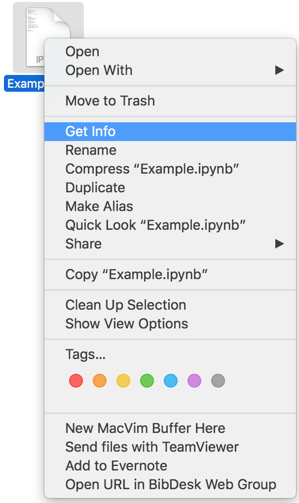

# ipynbOpener.app

Enables double-clicking to open a Jupyter Notebook file on an OSX.

## Prerequisites
**ipynbOpener** requires [conda](https://conda.io/en/latest/) to be already installed, and *jupyter* is installed in the *base* environment. i.e.

```BASH
<frankliuao~|501$> conda activate base
(base) <frankliuao~|502$> which jupyter
/Users/frankliuao/anaconda3/bin/jupyter
(base) <frankliuao~|503$> jupyter notebook
```

can be run in the Terminal.

## (Alternative ipynbOpener2)
If you are not using *conda*, but using package management software like *MacPorts* instead, you should use **ipynbOpener2.app** instead (also applies to the following usage section). Make suare you can do the following in your Terminal.
```BASH
<frankliuao~|501$> which jupyter
/opt/local/bin/jupyter
<frankliuao~|503$> jupyter notebook
```

## Usage
- Put the **ipynbOpener.app/** folder to the **/Applications/**

- Right-click on the Jupyter notebook file, in the menu, click on "Get Info".


- Under "Open with", choose the **ipynbOpener.app** from the dropdown list.


- Now you should be able to double click on any **.ipynb** file and open a Terminal window and your browser to edit the file in Jupyter notebook. Enjoy!
